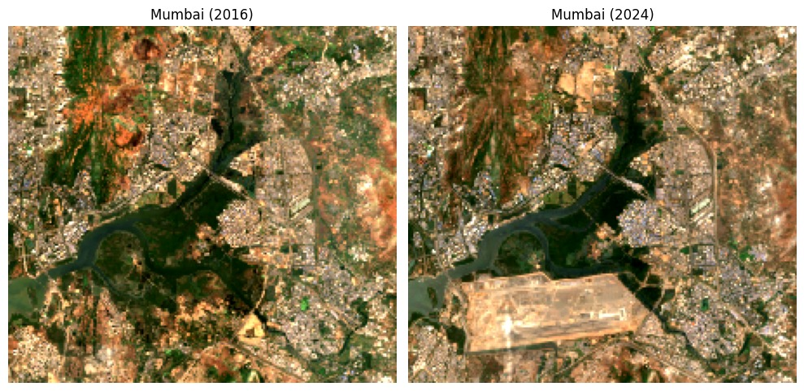

# Regime-Aware Remote Sensing Embeddings (Hackathon Repo)

## Motivation

The images above show a region near my home in Mumbai. Between 2016 and 2024, a major airport was constructed — transforming coastal and semi-urban land into large-scale infrastructure.

Most remote sensing foundation models are trained on static images. They capture spatial appearance (urban, vegetation, water), but often fail to encode **structural change over time**. Frame-by-frame, both images may simply look “urban,” despite representing a fundamental regime shift.

This project builds a **temporal regime-change benchmark** (HLS Sentinel-2 triplets: 2019/2021/2023) to test whether regime-aware representations can better capture multi-year structural change — not just appearance.

---

## What this repo contains

### Data summary (HLS triplets)
- **Locations:** 50 globally diverse points (see map + table below)
- **Source:** NASA HLS Sentinel-2 Surface Reflectance (**HLS S30 v2.0**)
- **Years:** 2019, 2021, 2023 (triplets)
- **Chip:** 256×256 pixels @ 30m, region size 7680m×7680m
- **Bands:** B02, B03, B04, B08, B11, B12 + Fmask
- **Patchify:** 64×64 non-overlapping patches (16 per chip)
- **Filters:** cloud fraction ≤ 0.20, valid fraction ≥ 0.70 (via Fmask)

Triplet dataset stats:
- Triplet samples: **776**
- Total patches considered: 800
- Dropped low-valid: 24
- Dropped cloudy: 0

---

## Tasks / labels

### Net-change (3-class) label (2019 → 2023)
NDVI per patch:
NDVI = (B08 − B04) / (B08 + B04)

Net change:
ΔNDVI = mean(NDVI_2023) − mean(NDVI_2019)

With threshold **δ = 0.05**:
- **0 (Decrease):** ΔNDVI < -0.05  
- **1 (Flat):** |ΔNDVI| ≤ 0.05  
- **2 (Increase):** ΔNDVI > 0.05  

Class distribution (n=782 for the pair dataset): Decrease 185, Flat 324, Increase 273.

### Curvature / non-monotonic label (harder, 4-class)
Uses intermediate year 2021:
Δ01 = mean(NDVI_2021) − mean(NDVI_2019)
Δ12 = mean(NDVI_2023) − mean(NDVI_2021)
Produces **y_curv4**: monotonic up, monotonic down, oscillatory, stable-ish.

---

## Splits (avoid leakage)

### Location-based split (default)
- 70% locations train / 30% locations test  
- Ensures **no patches from the same location appear in both splits**

### Geographic domain shift: Leave-one-continent-out
Train on all continents except one; test on the held-out continent.
(We also treat **South America** as the strongest shift case in our current set.)

---

### Interactive Locations Map

Open: **[View interactive map](https://gabrielnixon.github.io/TerraSense/assets/locations_map.html)**  

### Location list (IDs, names, lat/lon)
| ID | Name | Lat | Lon |
|---|---|---:|---:|
| mumbai_01 | Mumbai | 19.076 | 72.8777 |
| delhi_01 | Delhi | 28.6139 | 77.209 |
| bangalore_01 | Bengaluru | 12.9716 | 77.5946 |
| kolkata_01 | Kolkata | 22.5726 | 88.3639 |
| sydney_01 | Sydney | -33.8688 | 151.2093 |
| melbourne_01 | Melbourne | -37.8136 | 144.9631 |
| brisbane_01 | Brisbane | -27.4698 | 153.0251 |
| perth_01 | Perth | -31.9523 | 115.8613 |
| cairo_01 | Cairo | 30.0444 | 31.2357 |
| lagos_01 | Lagos | 6.5244 | 3.3792 |
| nairobi_01 | Nairobi | -1.2921 | 36.8219 |
| capetown_01 | Cape Town | -33.9249 | 18.4241 |
| johannesburg_01 | Johannesburg | -26.2041 | 28.0473 |
| accra_01 | Accra | 5.6037 | -0.187 |
| addis_01 | Addis Ababa | 8.9806 | 38.7578 |
| sao_01 | Sao Paulo | -23.5558 | -46.6396 |
| rio_01 | Rio de Janeiro | -22.9068 | -43.1729 |
| lima_01 | Lima | -12.0464 | -77.0428 |
| bogota_01 | Bogota | 4.711 | -74.0721 |
| santiago_01 | Santiago | -33.4489 | -70.6693 |
| buenos_01 | Buenos Aires | -34.6037 | -58.3816 |
| mexico_01 | Mexico City | 19.4326 | -99.1332 |
| la_01 | Los Angeles | 34.0522 | -118.2437 |
| nyc_01 | New York | 40.7128 | -74.006 |
| toronto_01 | Toronto | 43.6532 | -79.3832 |
| vancouver_01 | Vancouver | 49.2827 | -123.1207 |
| chicago_01 | Chicago | 41.8781 | -87.6298 |
| miami_01 | Miami | 25.7617 | -80.1918 |
| houston_01 | Houston | 29.7604 | -95.3698 |
| seattle_01 | Seattle | 47.6062 | -122.3321 |
| london_01 | London | 51.5074 | -0.1278 |
| paris_01 | Paris | 48.8566 | 2.3522 |
| berlin_01 | Berlin | 52.52 | 13.405 |
| madrid_01 | Madrid | 40.4168 | -3.7038 |
| rome_01 | Rome | 41.9028 | 12.4964 |
| istanbul_01 | Istanbul | 41.0082 | 28.9784 |
| moscow_01 | Moscow | 55.7558 | 37.6173 |
| stp_01 | St Petersburg | 59.9311 | 30.3609 |
| tehran_01 | Tehran | 35.6892 | 51.389 |
| dubai_01 | Dubai | 25.2048 | 55.2708 |
| riyadh_01 | Riyadh | 24.7136 | 46.6753 |
| tokyo_01 | Tokyo | 35.6762 | 139.6503 |
| seoul_01 | Seoul | 37.5665 | 126.978 |
| beijing_01 | Beijing | 39.9042 | 116.4074 |
| shanghai_01 | Shanghai | 31.2304 | 121.4737 |
| hongkong_01 | Hong Kong | 22.3193 | 114.1694 |
| singapore_01 | Singapore | 1.3521 | 103.8198 |
| jakarta_01 | Jakarta | -6.2088 | 106.8456 |
| manila_01 | Manila | 14.5995 | 120.9842 |
| auckland_01 | Auckland | -36.8485 | 174.7633 |

---

## Baselines and current results

### Raw-spectral baseline (pair, 2019→2023)
Logistic regression features:
- mean spectral values (2019)
- mean spectral values (2023)
- mean spectral difference (2023 − 2019)

**Test:** Accuracy 0.50, Macro-F1 0.47  
Per-class recall: Decrease 0.24, Flat 0.79, Increase 0.45

### CNN probe on triplet patches (seed=42, test_frac=0.30)
| Input | Test Acc | Test Macro-F1 |
|---|---:|---:|
| Diff2: (2021−2019) ⧺ (2023−2021) | 0.6983 | 0.6857 |
| Stack3: 2019 ⧺ 2021 ⧺ 2023 | 0.7241 | 0.6925 |

### A+ handcrafted regime-aware features (triplet)
Probe pipeline:
SimpleImputer(median) → StandardScaler → LogisticRegression(class_weight=balanced)

| Split | Train | Test | Acc | Macro-F1 |
|---|---:|---:|---:|---:|
| Standard (location-based) | 539 | 237 | 0.8059 | 0.8056 |
| Leave-out Asia | 597 | 179 | 0.9050 | 0.8987 |
| Leave-out Africa | 643 | 133 | 0.8346 | 0.8319 |
| Leave-out South America | 680 | 96 | 0.7500 | 0.7371 |

Curvature (4-class) on **South America** holdout:
- Accuracy 0.6458
- Macro-F1 0.4897 (n=96)

### Radiometric bias stress tests (A+ features)
- **NIR offset (standard split):** Macro-F1 drops from 0.8056 → 0.7612 at 5% offset
- **South America holdout:** performance stays ~stable across tested offsets/scales
  
---

## Foundation model distillation and evaluation (next section)

### Foundational model
Our current distillation pipeline uses **Prithvi-EO-2.0 (300M)** as the teacher model (Prithvi_EO_V2_300M_TL.pt) with 3-frame temporal input (2019/2021/2023) and 6 spectral channels mapped from HLS bands. The student is a smaller PrithviViT-style encoder with a projection head trained to match teacher CLS + pooled patch embeddings via cosine-based distillation loss.

### Distillation setup (implemented)
- **Teacher:** frozen Prithvi-EO-2.0 temporal encoder
- **Student:** lightweight temporal ViT encoder (embed_dim=256, depth=8)
- **Loss:** weighted cosine alignment (0.7 * CLS + 0.3 * pooled-patch)
- **Output checkpoints:** ckpts/student_ep*.pt

### Tests/evaluations completed so far
We currently run evaluation scripts across both in-domain and transfer settings:
- **Remote-sensing classification transfer:** EuroSAT / EuroSAT-MSI linear probes
- **Change detection transfer:** OSCD and LEVIR-CD teacher–student comparisons
- **Crop/time-series transfer:** TimeSen2Crop teacher–student comparisons
- **Geographic/domain benchmarks:** location ID and country prediction
- **Regime benchmark checks:** net-change and curvature probes + shift robustness tests

### Result table

#### Transfer/classification benchmarks
| Task | Metric | Teacher | Student | Delta |
|---|---|---:|---:|---:|
| EuroSAT | Accuracy | 0.956 | 0.825 | -0.131 |
| TimeSen2Crop | Accuracy | 0.89 | 0.77 | -0.12 |

#### Change detection benchmarks
| Task | Split |Teacher | Student | Delta |
|---|---|---|---:|---:|
| OSCD | Accuracy | 0.538 | 0.471 | -0.067 |
| LEVIR-CD |  Accuracy | 0.844 | 0.761 | -0.083 |
| S2-Looking |  Accuracy | 0.837 | 0.915 | 0.078 |

## Model Scale & Parameter Efficiency

Our distillation setup is explicitly designed to compress a large-scale temporal foundation model into a lightweight regime-aware encoder suitable for faster inference and smaller deployments.

### Teacher vs Student Architecture

| Component | Teacher (Prithvi-EO-2.0) | Student (Temporal ViT - Small) |
|------------|--------------------------|---------------------------------|
| Model type | Temporal MAE Transformer | Temporal ViT encoder |
| Parameters | ~300M | ~25–40M (depending on head) |
| Embed dim | 1024 | 256 |
| Depth | 24 layers (approx) | 8 layers |
| Heads | 16 | 8 |
| Input | 3 frames × 6 bands | 3 frames × 6 bands |
| Training | Fully pretrained | Distilled from teacher |
| Frozen? | Yes (during distillation) | No |

### Compression Ratio

- **Parameter reduction:** ~8–12× smaller  
- **Embedding dimensionality reduction:** 1024 → 256 (4× smaller latent space)
- **Transformer depth reduction:** ~3× fewer layers
- **Lower memory footprint** for inference
- **Faster forward passes** and easier multi-GPU scaling

### Why This Matters

Prithvi-EO-2.0 (300M parameters) is powerful but heavy:
- High GPU memory usage
- Slower inference
- Not practical for edge or scalable deployment

Our student model:
- Retains temporal reasoning
- Preserves multi-frame structure
- Learns regime-aware embeddings
- Is substantially more compute-efficient

The goal is not just compression —  
it is **efficient temporal representation learning under regime shift**, while maintaining transfer performance across:

- Classification
- Change detection
- Crop/time-series prediction
- Geographic generalization
